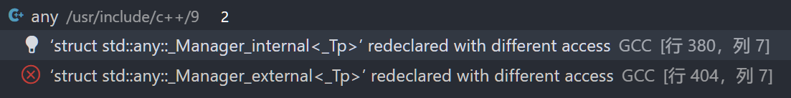

# ZLex

基于正则的词法分析器生成器

## 模块
1. 配置文件读取
2. 构建FA
3. 目标文件解析

## 配置文件解析

文件配置方式参考flex

**注意问题:**
- 缓冲?

## FA

### IO
input: pattern-action集合

output: FA

**TODO:**
- 打印构建出的状态机(使用mermaid)
  - 

- 多线程加速


### 思路
1. 解析正则
   - [x] 添加显式的union
   - [x] 中缀正则转为后缀
2. 根据正则构建NFA
    - [x] 基础正则语法: union, |, * 与顺手写的 ?, +
    - [ ] 复杂语法: [], ^, $
3. 合并NFA
4. 根据NFA构建DFA (最小化)

## 目标文件解析

根据FA, 对文件进行词法分析

### 对外提供的全局变量
#### flex
- yytext: 字符指针, 指向当前匹配的文本
- yyleng: 当前匹配的文本的长度
- yyin: 文件指针, 当前输入流
- yyout: 文件指针, 当前输出流
- yylineno: 当前输入的行号

#### zlex


注意问题:
- 异常信息记录
- 匹配时action的执行

## 踩坑记录

### ‘struct xxx’ redeclared with different access

#### 问题描述



测试时使用 `#define protected public`, `#define private public`便于访问私有成员
最开始都是可行的, 在使用std::any后出现问题


#### 问题分析

参考博客: [C++ 单元测试 访问控制小坑](https://www.zhaowenke.com/post/cpp-unittest-1/) 

```c++
class any
{
    /**
     * ......
     */

    template <typename _Tp>
    struct _Manager_internal; // uses small-object optimization

    template <typename _Tp>
    struct _Manager_external; // creates contained object on the heap

    /**
     * ......
     */
private:  // 这里被我的define变成了public
    // Manage in-place contained object.
    template <typename _Tp>
    struct _Manager_internal
    {
        // ... 结构体定义
    };

    // Manage external contained object.
    template <typename _Tp>
    struct _Manager_internal
    {
        // ... 结构体定义
    };

    // ...
}
```

可知, 在any中 `struct _Manager_internal`和`struct _Manager_internal`在定义时没有写访问限定符, 在C++中, 此时访问权限为默认的***private***

那么此时就能知道问题的答案了: 在编译时, 一个成员变量先是被声明为private, 然后在结构体定义时, 因为`#define private public`导致结构体权限变为public

即编译器报错信息:  redeclared with different access


#### 解决方案

使用`-fno-access-control`去关闭访问控制, 不要使用define!
