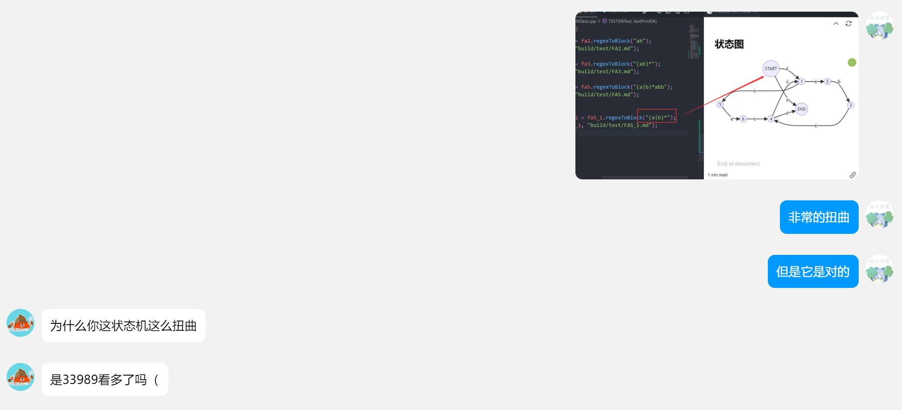

# ZLex

基于正则的词法分析器生成器

## 模块
1. 配置文件读取
2. 构建FA
3. 目标文件解析

## 配置文件解析

文件配置方式参考flex

**注意问题:**
- 缓冲?

## FA

### IO
input: pattern-action集合

output: FA

**TODO:**
- 打印构建出的状态机(使用mermaid)
  - 

- 多线程加速

### 思路
1. 解析正则
   - [x] 添加显式的union
   - [x] 中缀正则转为后缀
2. 根据正则构建NFA
    - [x] 基础正则语法: union, |, * 与顺手写的 ?, +
    - [ ] 复杂语法: [], ^, $
3. 合并NFA
4. 根据NFA构建DFA (最小化)

## 目标文件解析

根据FA, 对文件进行词法分析

注意问题:
- 异常信息记录
- 匹配时action的执行
- 