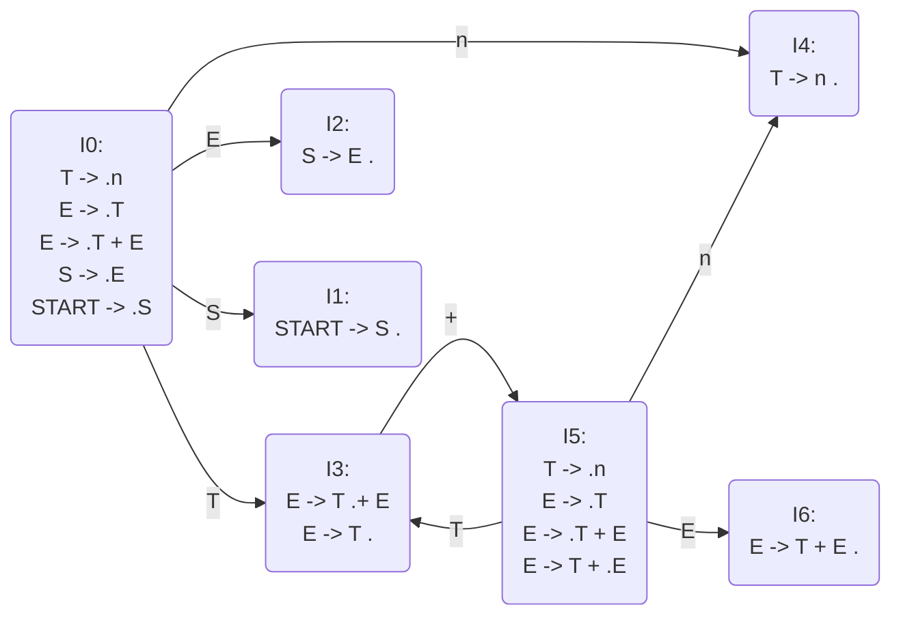

```mermaid
graph LR
node0(<div>I0:<br>T -> .n <br>E -> .T <br>E -> .T + E <br>S -> .E <br>START -> .S <br></div>)
node0--> |n| node4
node0--> |T| node3
node0--> |E| node2
node0--> |S| node1
node1(<div>I1:<br>START -> S .<br></div>)
node2(<div>I2:<br>S -> E .<br></div>)
node3(<div>I3:<br>E -> T .+ E <br>E -> T .<br></div>)
node3--> |+| node5
node4(<div>I4:<br>T -> n .<br></div>)
node5(<div>I5:<br>T -> .n <br>E -> .T <br>E -> .T + E <br>E -> T + .E <br></div>)
node5--> |n| node4
node5--> |T| node3
node5--> |E| node6
node6(<div>I6:<br>E -> T + E .<br></div>)
```