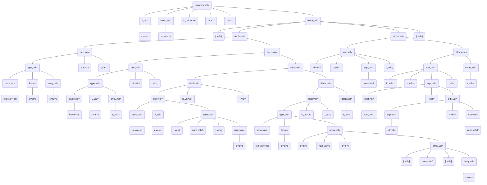

Generated by 
```text
 _________   _    ____  ____  _____ ____  
|__  /  _ \ / \  |  _ \/ ___|| ____|  _ \ 
  / /| |_) / _ \ | |_) \___ \|  _| | |_) |
 / /_|  __/ ___ \|  _ < ___) | |___|  _ < 
/____|_| /_/   \_\_| \_\____/|_____|_| \_\

```
Generate time: Tue Jun  4 21:40:55 2024

## 语法树

