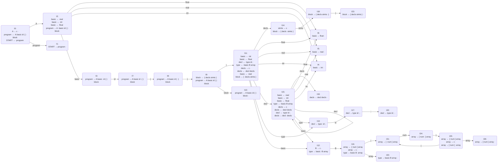

## 产生式

- program → A basic id ( ) block 
- A → ε 
- block → { decls stmts } 
- stmts → ε 
- decls → decl decls 
- decls → ε 
- decl → type id ; 
- type → basic B array 
- B → ε 
- array → ε 
- array → [ num ] array 
- basic → float 
- basic → int 
- basic → real 
- START → program 

## FA Graph

