## 产生式

- program → A basic id ( ) block 
- A → ε 
- block → { decls stmts } 
- decls → decl decls 
- decls → ε 
- decl → type id ; 
- type → basic B array 
- B → ε 
- array → ε 
- array → [ num ] array 
- basic → float 
- basic → int 
- basic → real 
- stmts → stmt stmts 
- stmts → ε 
- stmt → id = expr ; 
- expr → expr + expr 
- expr → expr - expr 
- expr → expr * expr 
- expr → expr / expr 
- expr → - expr 
- expr → ( expr ) 
- expr → id 
- expr → num 
- START → program 

## FA Graph

```mermaid
	graph LR
	node0("<div>I0:<br>A → ε ·<br>program → ·A basic id ( ) block <br>START → ·program <br></div>")
	node0--> |"A"| node2
	node0--> |"program"| node1
	node1("<div>I1:<br>START → program ·<br></div>")
	node2("<div>I2:<br>basic → ·real <br>basic → ·int <br>basic → ·float <br>program → A ·basic id ( ) block <br></div>")
	node2--> |"int"| node6
	node2--> |"real"| node5
	node2--> |"float"| node4
	node2--> |"basic"| node3
	node3("<div>I3:<br>program → A basic ·id ( ) block <br></div>")
	node3--> |"id"| node7
	node4("<div>I4:<br>basic → float ·<br></div>")
	node5("<div>I5:<br>basic → real ·<br></div>")
	node6("<div>I6:<br>basic → int ·<br></div>")
	node7("<div>I7:<br>program → A basic id ·( ) block <br></div>")
	node7--> |"("| node8
	node8("<div>I8:<br>program → A basic id ( ·) block <br></div>")
	node8--> |")"| node9
	node9("<div>I9:<br>block → ·{ decls stmts } <br>program → A basic id ( ) ·block <br></div>")
	node9--> |"block"| node11
	node9--> |"{"| node10
	node10("<div>I10:<br>basic → ·real <br>basic → ·int <br>basic → ·float <br>decl → ·type id ; <br>type → ·basic B array <br>decls → ε ·<br>decls → ·decl decls <br>block → { ·decls stmts } <br></div>")
	node10--> |"int"| node6
	node10--> |"real"| node5
	node10--> |"float"| node4
	node10--> |"basic"| node14
	node10--> |"decls"| node13
	node10--> |"type"| node15
	node10--> |"decl"| node12
	node11("<div>I11:<br>program → A basic id ( ) block ·<br></div>")
	node12("<div>I12:<br>basic → ·real <br>basic → ·int <br>basic → ·float <br>decl → ·type id ; <br>type → ·basic B array <br>decls → ε ·<br>decls → ·decl decls <br>decls → decl ·decls <br></div>")
	node12--> |"int"| node6
	node12--> |"real"| node5
	node12--> |"float"| node4
	node12--> |"basic"| node14
	node12--> |"decls"| node16
	node12--> |"type"| node15
	node12--> |"decl"| node12
	node13("<div>I13:<br>stmt → ·id = expr ; <br>stmts → ε ·<br>stmts → ·stmt stmts <br>block → { decls ·stmts } <br></div>")
	node13--> |"stmts"| node19
	node13--> |"id"| node18
	node13--> |"stmt"| node17
	node14("<div>I14:<br>B → ε ·<br>type → basic ·B array <br></div>")
	node14--> |"B"| node20
	node15("<div>I15:<br>decl → type ·id ; <br></div>")
	node15--> |"id"| node21
	node16("<div>I16:<br>decls → decl decls ·<br></div>")
	node17("<div>I17:<br>stmts → ε ·<br>stmts → ·stmt stmts <br>stmt → ·id = expr ; <br>stmts → stmt ·stmts <br></div>")
	node17--> |"stmts"| node22
	node17--> |"id"| node18
	node17--> |"stmt"| node17
	node18("<div>I18:<br>stmt → id ·= expr ; <br></div>")
	node18--> |"="| node23
	node19("<div>I19:<br>block → { decls stmts ·} <br></div>")
	node19--> |"}"| node24
	node20("<div>I20:<br>array → ·[ num ] array <br>array → ε ·<br>type → basic B ·array <br></div>")
	node20--> |"array"| node26
	node20--> |"["| node25
	node21("<div>I21:<br>decl → type id ·; <br></div>")
	node21--> |";"| node27
	node22("<div>I22:<br>stmts → stmt stmts ·<br></div>")
	node23("<div>I23:<br>expr → ·num <br>expr → ·id <br>expr → ·( expr ) <br>expr → ·- expr <br>expr → ·expr / expr <br>expr → ·expr * expr <br>expr → ·expr - expr <br>expr → ·expr + expr <br>stmt → id = ·expr ; <br></div>")
	node23--> |"id"| node32
	node23--> |"expr"| node31
	node23--> |"-"| node30
	node23--> |"("| node29
	node23--> |"num"| node28
	node24("<div>I24:<br>block → { decls stmts } ·<br></div>")
	node25("<div>I25:<br>array → [ ·num ] array <br></div>")
	node25--> |"num"| node33
	node26("<div>I26:<br>type → basic B array ·<br></div>")
	node27("<div>I27:<br>decl → type id ; ·<br></div>")
	node28("<div>I28:<br>expr → num ·<br></div>")
	node29("<div>I29:<br>expr → ·id <br>expr → ·( expr ) <br>expr → ·- expr <br>expr → ·expr / expr <br>expr → ·expr * expr <br>expr → ·expr - expr <br>expr → ·expr + expr <br>expr → ·num <br>expr → ( ·expr ) <br></div>")
	node29--> |"id"| node32
	node29--> |"expr"| node34
	node29--> |"-"| node30
	node29--> |"("| node29
	node29--> |"num"| node28
	node30("<div>I30:<br>expr → ·num <br>expr → ·( expr ) <br>expr → ·- expr <br>expr → ·expr / expr <br>expr → ·expr * expr <br>expr → ·expr - expr <br>expr → ·expr + expr <br>expr → ·id <br>expr → - ·expr <br></div>")
	node30--> |"id"| node32
	node30--> |"expr"| node35
	node30--> |"-"| node30
	node30--> |"("| node29
	node30--> |"num"| node28
	node31("<div>I31:<br>stmt → id = expr ·; <br>expr → expr ·+ expr <br>expr → expr ·- expr <br>expr → expr ·* expr <br>expr → expr ·/ expr <br></div>")
	node31--> |"/"| node39
	node31--> |"+"| node40
	node31--> |"*"| node38
	node31--> |"-"| node37
	node31--> |";"| node36
	node32("<div>I32:<br>expr → id ·<br></div>")
	node33("<div>I33:<br>array → [ num ·] array <br></div>")
	node33--> |"]"| node41
	node34("<div>I34:<br>expr → expr ·+ expr <br>expr → expr ·- expr <br>expr → expr ·* expr <br>expr → ( expr ·) <br>expr → expr ·/ expr <br></div>")
	node34--> |"/"| node39
	node34--> |"+"| node40
	node34--> |"*"| node38
	node34--> |"-"| node37
	node34--> |")"| node42
	node35("<div>I35:<br>expr → expr ·+ expr <br>expr → expr ·- expr <br>expr → - expr ·<br>expr → expr ·* expr <br>expr → expr ·/ expr <br></div>")
	node35--> |"/"| node39
	node35--> |"+"| node40
	node35--> |"*"| node38
	node35--> |"-"| node37
	node36("<div>I36:<br>stmt → id = expr ; ·<br></div>")
	node37("<div>I37:<br>expr → ·num <br>expr → ·id <br>expr → ·- expr <br>expr → ·expr / expr <br>expr → ·expr * expr <br>expr → ·expr - expr <br>expr → ·expr + expr <br>expr → ·( expr ) <br>expr → expr - ·expr <br></div>")
	node37--> |"id"| node32
	node37--> |"expr"| node43
	node37--> |"-"| node30
	node37--> |"("| node29
	node37--> |"num"| node28
	node38("<div>I38:<br>expr → ·num <br>expr → ·( expr ) <br>expr → ·- expr <br>expr → ·expr / expr <br>expr → ·expr * expr <br>expr → ·expr - expr <br>expr → ·expr + expr <br>expr → ·id <br>expr → expr * ·expr <br></div>")
	node38--> |"id"| node32
	node38--> |"expr"| node44
	node38--> |"-"| node30
	node38--> |"("| node29
	node38--> |"num"| node28
	node39("<div>I39:<br>expr → ·id <br>expr → ·( expr ) <br>expr → ·- expr <br>expr → ·expr / expr <br>expr → ·expr * expr <br>expr → ·expr - expr <br>expr → ·expr + expr <br>expr → ·num <br>expr → expr / ·expr <br></div>")
	node39--> |"id"| node32
	node39--> |"expr"| node45
	node39--> |"-"| node30
	node39--> |"("| node29
	node39--> |"num"| node28
	node40("<div>I40:<br>expr → ·num <br>expr → ·id <br>expr → ·( expr ) <br>expr → ·expr / expr <br>expr → ·expr * expr <br>expr → ·expr - expr <br>expr → ·expr + expr <br>expr → ·- expr <br>expr → expr + ·expr <br></div>")
	node40--> |"id"| node32
	node40--> |"expr"| node46
	node40--> |"-"| node30
	node40--> |"("| node29
	node40--> |"num"| node28
	node41("<div>I41:<br>array → ·[ num ] array <br>array → ε ·<br>array → [ num ] ·array <br></div>")
	node41--> |"array"| node47
	node41--> |"["| node25
	node42("<div>I42:<br>expr → ( expr ) ·<br></div>")
	node43("<div>I43:<br>expr → expr - expr ·<br>expr → expr ·+ expr <br>expr → expr ·- expr <br>expr → expr ·* expr <br>expr → expr ·/ expr <br></div>")
	node43--> |"/"| node39
	node43--> |"+"| node40
	node43--> |"*"| node38
	node43--> |"-"| node37
	node44("<div>I44:<br>expr → expr * expr ·<br>expr → expr ·+ expr <br>expr → expr ·- expr <br>expr → expr ·* expr <br>expr → expr ·/ expr <br></div>")
	node44--> |"/"| node39
	node44--> |"+"| node40
	node44--> |"*"| node38
	node44--> |"-"| node37
	node45("<div>I45:<br>expr → expr / expr ·<br>expr → expr ·+ expr <br>expr → expr ·- expr <br>expr → expr ·* expr <br>expr → expr ·/ expr <br></div>")
	node45--> |"/"| node39
	node45--> |"+"| node40
	node45--> |"*"| node38
	node45--> |"-"| node37
	node46("<div>I46:<br>expr → expr + expr ·<br>expr → expr ·+ expr <br>expr → expr ·- expr <br>expr → expr ·* expr <br>expr → expr ·/ expr <br></div>")
	node46--> |"/"| node39
	node46--> |"+"| node40
	node46--> |"*"| node38
	node46--> |"-"| node37
	node47("<div>I47:<br>array → [ num ] array ·<br></div>")
```

