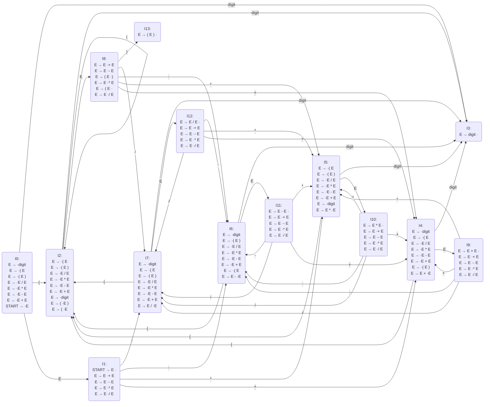

## 产生式

- E → E + E 
- E → E - E 
- E → E * E 
- E → E / E 
- E → ( E ) 
- E → ( E 
- E → digit 
- START → E 

## FA Graph

```mermaid
	graph LR
	node0("<div>I0:<br>E → ·digit <br>E → ·( E <br>E → ·( E ) <br>E → ·E / E <br>E → ·E * E <br>E → ·E - E <br>E → ·E + E <br>START → ·E <br></div>")
	node0--> |"digit"| node3
	node0--> |"("| node2
	node0--> |"E"| node1
	node1("<div>I1:<br>START → E ·<br>E → E ·+ E <br>E → E ·- E <br>E → E ·* E <br>E → E ·/ E <br></div>")
	node1--> |"/"| node7
	node1--> |"-"| node6
	node1--> |"*"| node5
	node1--> |"+"| node4
	node2("<div>I2:<br>E → ·( E <br>E → ·( E ) <br>E → ·E / E <br>E → ·E * E <br>E → ·E - E <br>E → ·E + E <br>E → ·digit <br>E → ( ·E ) <br>E → ( ·E <br></div>")
	node2--> |"digit"| node3
	node2--> |"("| node2
	node2--> |"E"| node8
	node3("<div>I3:<br>E → digit ·<br></div>")
	node4("<div>I4:<br>E → ·digit <br>E → ·( E <br>E → ·E / E <br>E → ·E * E <br>E → ·E - E <br>E → ·E + E <br>E → ·( E ) <br>E → E + ·E <br></div>")
	node4--> |"digit"| node3
	node4--> |"("| node2
	node4--> |"E"| node9
	node5("<div>I5:<br>E → ·( E <br>E → ·( E ) <br>E → ·E / E <br>E → ·E * E <br>E → ·E - E <br>E → ·E + E <br>E → ·digit <br>E → E * ·E <br></div>")
	node5--> |"digit"| node3
	node5--> |"("| node2
	node5--> |"E"| node10
	node6("<div>I6:<br>E → ·digit <br>E → ·( E ) <br>E → ·E / E <br>E → ·E * E <br>E → ·E - E <br>E → ·E + E <br>E → ·( E <br>E → E - ·E <br></div>")
	node6--> |"digit"| node3
	node6--> |"("| node2
	node6--> |"E"| node11
	node7("<div>I7:<br>E → ·digit <br>E → ·( E <br>E → ·( E ) <br>E → ·E / E <br>E → ·E * E <br>E → ·E - E <br>E → ·E + E <br>E → E / ·E <br></div>")
	node7--> |"digit"| node3
	node7--> |"("| node2
	node7--> |"E"| node12
	node8("<div>I8:<br>E → E ·+ E <br>E → E ·- E <br>E → ( E ·) <br>E → E ·* E <br>E → ( E ·<br>E → E ·/ E <br></div>")
	node8--> |")"| node13
	node8--> |"/"| node7
	node8--> |"-"| node6
	node8--> |"*"| node5
	node8--> |"+"| node4
	node9("<div>I9:<br>E → E + E ·<br>E → E ·+ E <br>E → E ·- E <br>E → E ·* E <br>E → E ·/ E <br></div>")
	node9--> |"/"| node7
	node9--> |"-"| node6
	node9--> |"*"| node5
	node9--> |"+"| node4
	node10("<div>I10:<br>E → E * E ·<br>E → E ·+ E <br>E → E ·- E <br>E → E ·* E <br>E → E ·/ E <br></div>")
	node10--> |"/"| node7
	node10--> |"-"| node6
	node10--> |"*"| node5
	node10--> |"+"| node4
	node11("<div>I11:<br>E → E - E ·<br>E → E ·+ E <br>E → E ·- E <br>E → E ·* E <br>E → E ·/ E <br></div>")
	node11--> |"/"| node7
	node11--> |"-"| node6
	node11--> |"*"| node5
	node11--> |"+"| node4
	node12("<div>I12:<br>E → E / E ·<br>E → E ·+ E <br>E → E ·- E <br>E → E ·* E <br>E → E ·/ E <br></div>")
	node12--> |"/"| node7
	node12--> |"-"| node6
	node12--> |"*"| node5
	node12--> |"+"| node4
	node13("<div>I13:<br>E → ( E ) ·<br></div>")
```
