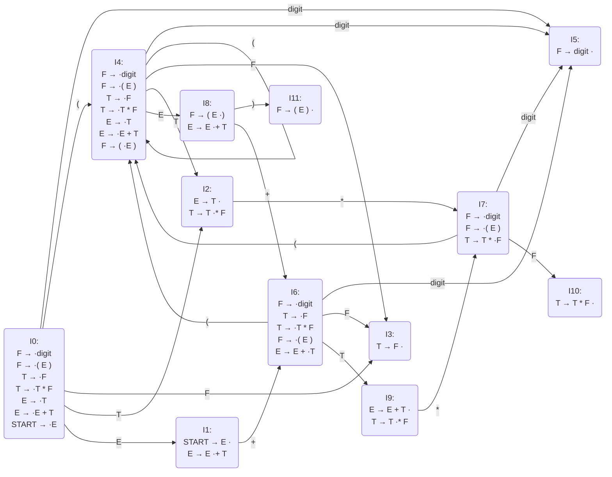

## 产生式

- E → E + T 
- E → T 
- T → T * F 
- T → F 
- F → ( E ) 
- F → digit 
- START → E 

## FA Graph

```mermaid
	graph LR
	node0("<div>I0:<br>F → ·digit <br>F → ·( E ) <br>T → ·F <br>T → ·T * F <br>E → ·T <br>E → ·E + T <br>START → ·E <br>"</div>)
	node0--> |"digit"| node5
	node0--> |"("| node4
	node0--> |"F"| node3
	node0--> |"T"| node2
	node0--> |"E"| node1
	node1("<div>I1:<br>START → E ·<br>E → E ·+ T <br>"</div>)
	node1--> |"+"| node6
	node2("<div>I2:<br>E → T ·<br>T → T ·* F <br>"</div>)
	node2--> |"*"| node7
	node3("<div>I3:<br>T → F ·<br>"</div>)
	node4("<div>I4:<br>F → ·digit <br>F → ·( E ) <br>T → ·F <br>T → ·T * F <br>E → ·T <br>E → ·E + T <br>F → ( ·E ) <br>"</div>)
	node4--> |"digit"| node5
	node4--> |"("| node4
	node4--> |"F"| node3
	node4--> |"T"| node2
	node4--> |"E"| node8
	node5("<div>I5:<br>F → digit ·<br>"</div>)
	node6("<div>I6:<br>F → ·digit <br>T → ·F <br>T → ·T * F <br>F → ·( E ) <br>E → E + ·T <br>"</div>)
	node6--> |"digit"| node5
	node6--> |"("| node4
	node6--> |"F"| node3
	node6--> |"T"| node9
	node7("<div>I7:<br>F → ·digit <br>F → ·( E ) <br>T → T * ·F <br>"</div>)
	node7--> |"digit"| node5
	node7--> |"("| node4
	node7--> |"F"| node10
	node8("<div>I8:<br>F → ( E ·) <br>E → E ·+ T <br>"</div>)
	node8--> |")"| node11
	node8--> |"+"| node6
	node9("<div>I9:<br>E → E + T ·<br>T → T ·* F <br>"</div>)
	node9--> |"*"| node7
	node10("<div>I10:<br>T → T * F ·<br>"</div>)
	node11("<div>I11:<br>F → ( E ) ·<br>"</div>)
```
